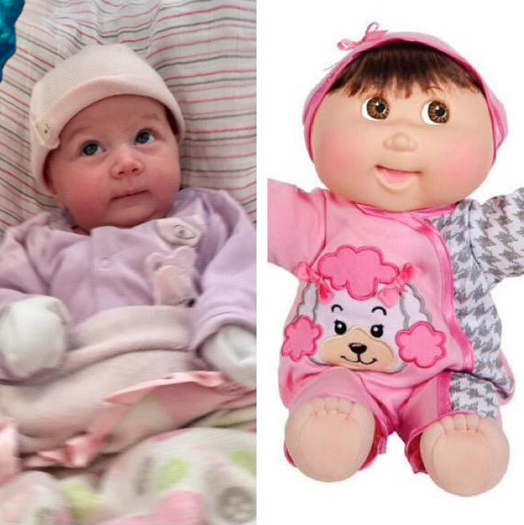

# B"H

(command + shit + p (preview))

## This is slightly smaller

## This is even smaller

### This is even smaller

#### This is even smaller

This is normal font

This is normal text with a list:
- Mendy
- Baruch 
    - Car
    - Truck
- Yossi
---
This numbered list:
1. House
2. Car
---
This following word is in **bold** *ilalics* ***bold ilatics***

Hi here is a cool `SQL` script:

```sql

select   *
from     fake-tbl
where    col = 1
order by col_1

```
Here is an image: (always leave a blank line under an image)



---

[My GitHub Repository](https://github.com/mefune/coding-deep-dive)

Here is a table: (command + shift + p (insert table))

|  Name |  City | DOB |
|---|---|---|
| Baruch  | Hove  | 01/01/01 |
| Mendy | Brighton | 02/02/02 |

